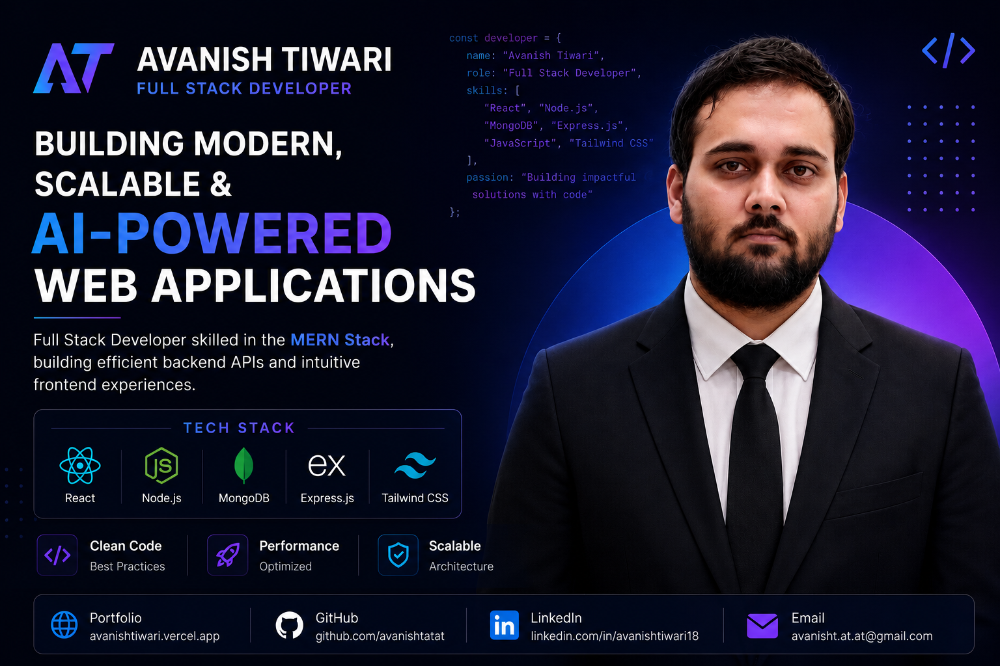

# Avanish Tiwari Portfolio




A production-ready developer portfolio built with **React, TypeScript, Vite, and Tailwind CSS** to showcase my projects, technical skills, professional experience, and software engineering journey.

The portfolio emphasizes **performance, accessibility, responsive design, clean architecture, and modern UI**, providing recruiters and fellow developers with an engaging overview of my work.

---

## 🌐 Live Demo

**Portfolio:** https://avanishtiwari.vercel.app

---

## ✨ Features

### 🎨 Modern User Experience

- Modern glassmorphism-inspired UI
- Smooth animations powered by Framer Motion
- Responsive design across mobile, tablet, and desktop
- Interactive hero section
- Smooth scrolling navigation
- Professional dark theme

### 💼 Portfolio Sections

- Hero
- About
- Featured Projects
- Professional Work
- Technical Skills
- Experience
- Contact
- Footer

### ⚙️ Engineering Highlights

- Built with React 18 + TypeScript
- Optimized using Vite
- SEO-ready metadata
- Open Graph & Twitter Cards
- Canonical URL support
- Lighthouse Accessibility Score: **100**
- Responsive across multiple screen sizes
- Contact form powered by EmailJS
- SPA routing configured for Vercel

---

## 🛠 Tech Stack

### Frontend

- React 18
- TypeScript
- Vite
- Tailwind CSS
- React Router

### UI & Animation

- Framer Motion
- shadcn/ui
- Radix UI
- Lucide React
- React Icons
- Sonner

### Services

- EmailJS

### Deployment

- Vercel

---

## 📂 Project Structure

```text
.
├── public/
│   ├── at-favicon.svg
│   ├── favicon.ico
│   └── og-image.png
│
├── src/
│   ├── components/
│   │   └── portfolio/
│   │       ├── About.tsx
│   │       ├── Contact.tsx
│   │       ├── Experience.tsx
│   │       ├── Footer.tsx
│   │       ├── Hero.tsx
│   │       ├── LoadingScreen.tsx
│   │       ├── Navbar.tsx
│   │       ├── ParticleBackground.tsx
│   │       ├── Projects.tsx
│   │       └── Skills.tsx
│   │
│   ├── data/
│   ├── pages/
│   │   ├── Index.tsx
│   │   └── NotFound.tsx
│   │
│   └── main.tsx
│
├── index.html
├── vercel.json
└── README.md
```

---

## 🚀 Getting Started

### 1. Clone the repository

```bash
git clone https://github.com/avanishtatat/Avanish-Developer-Portfolio.git
cd Avanish-Developer-Portfolio
```

### 2. Install dependencies

```bash
npm install
```

### 3. Configure Environment Variables

Copy `.env.example` to `.env` and update the EmailJS credentials.

```env
VITE_EMAILJS_SERVICE_ID=your_service_id
VITE_EMAILJS_TEMPLATE_ID=your_template_id
VITE_EMAILJS_PUBLIC_KEY=your_public_key
```

### 4. Start the Development Server

```bash
npm run dev
```

Open:

```
http://localhost:5173
```

---

## 📜 Available Scripts

```bash
npm run dev        # Start development server
npm run build      # Create production build
npm run preview    # Preview production build
npm run lint       # Run ESLint
npm run test       # Run Vitest tests
```

---

## 📈 Performance & Accessibility

This portfolio follows modern frontend best practices with a focus on quality and maintainability.

- ⚡ Optimized production build using Vite
- ♿ Lighthouse Accessibility Score: **100**
- 🔍 SEO-ready metadata
- 🌐 Open Graph & Twitter Card support
- 📱 Fully responsive layout
- ✨ Smooth animations with Framer Motion
- 📬 Functional EmailJS contact form
- 🚀 Production deployment on Vercel

---

## 📬 Contact

The contact form is powered by **EmailJS**, allowing visitors to send messages directly without requiring a custom backend.

---

## 🚀 Deployment

Create a production build:

```bash
npm run build
```

The generated `dist/` folder can be deployed to any static hosting platform.

Recommended providers:

- Vercel
- Netlify
- Cloudflare Pages
- GitHub Pages

---

## 👨‍💻 Author

**Avanish Tiwari**

- 🌐 Portfolio: https://avanishtiwari.vercel.app
- 💼 LinkedIn: https://linkedin.com/in/avanishtiwari18
- 💻 GitHub: https://github.com/avanishtatat
- 📧 Email: avanisht.at.at@gmail.com

---

## ⭐ Support

If you found this project helpful or interesting, consider giving it a **⭐ Star** on GitHub.

Feedback, suggestions, and contributions are always welcome.